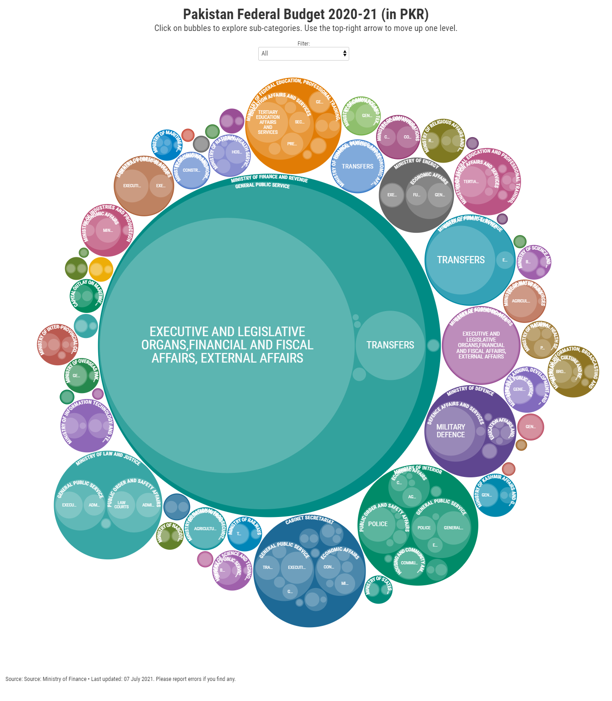
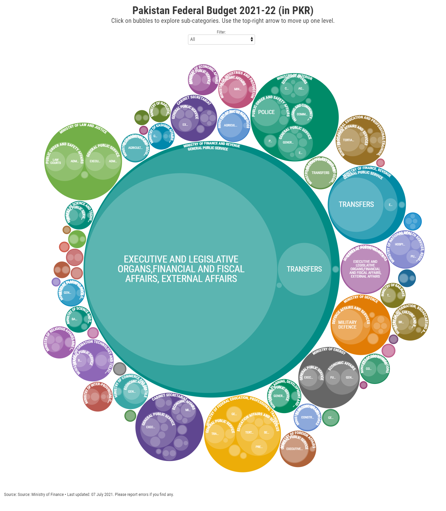
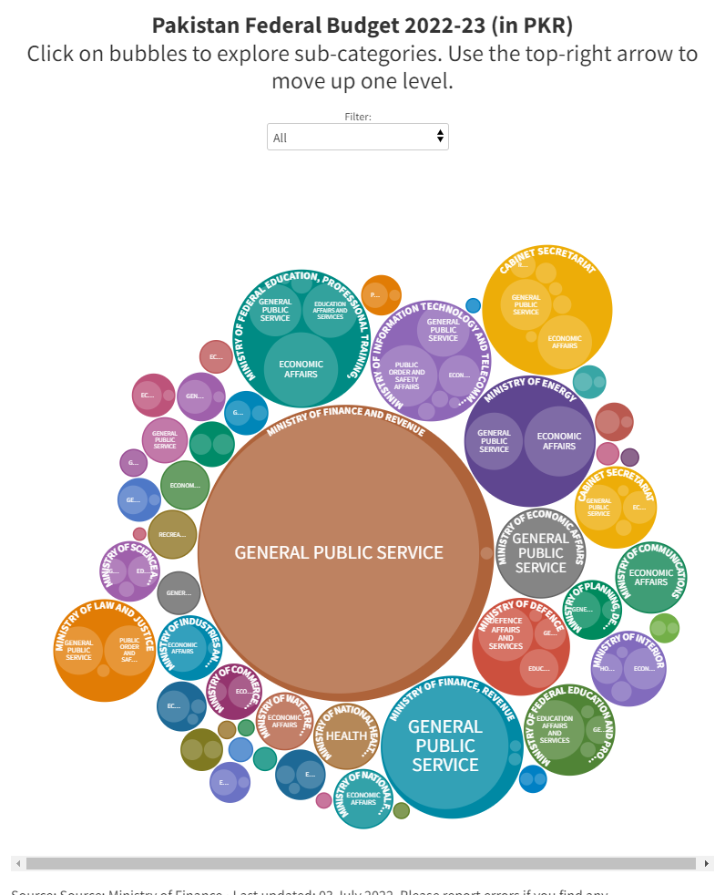

# 🇵🇰 WakalaLens Pakistan (وکالت لینس)

> **Submission for the AI for Civic Innovation Hackathon 2025**  
> A cutting-edge, bilingual budget intelligence and democratic accountability platform that turns Pakistan’s raw public finance spreadsheets and legislative records into plain-language, visual insights for citizens, journalists, and researchers.

---

## 🎯 The Civic Problem & Our Solution

Public finance documents in Pakistan are historically released as massive, complex Excel sheets or scanned PDFs. They are highly inaccessible to the average citizen, hiding crucial data on how public funds are allocated. Similarly, legislative performance (MNA attendance, bills sponsored) is scattered across poorly indexable portal tables.

**WakalaLens Pakistan** bridges this gap by combining official raw finance datasets with advanced AI reasoning, clean charts, and interactive calculators:
1. **Demystifying Budget Jargon:** Translating dry ministry figures into simple, contextual English and Urdu.
2. **Citizen-First Tax Transparency:** Instantly visualizing exactly where every rupee of your income tax goes.
3. **MNA Performance Tracking:** Giving voters a direct look at the attendance, legislative activity, and AI-rated grades of their elected representatives.

---

## ✨ Features

### 1. 🏛️ Constituency ➔ MNA Hero Lookup
Right at the top of the **WakalaCheck** page, a prominent autocomplete lookup allows users to type in their constituency (e.g. `NA-242 Karachi`) or the name of an MNA. Selecting a profile instantly scrolls to and displays their official metrics:
- **Attendance Rate:** Visualized with intuitive color-coded rings (Green for ≥75%, Amber for ≥50%, Red for low attendance).
- **Legislation Activity:** Number of bills sponsored and questions raised.
- **Official Salary Status:** A clear indicator of the official salary received during their term.
- **AI Performance Grade:** Gemini-powered grade based on overall parliamentary presence and productivity.

### 2. 📊 3-Year Budget Trend Explorer
Select any federal ministry and analyze their budget trajectory from **FY2023-24 to FY2025-26**. 
- **Normalized Data:** Names are mapped systematically to ensure consistent multi-year comparison despite administrative name changes.
- **Debt Exclusions:** Excludes massive domestic debt principal roll-overs (`REPAYMENT OF DOMESTIC DEBT`) to highlight true operating budgets and net interest costs (Debt Servicing).

### 3. 🔍 Ministry Transparency Score (T-Grade)
Every ministry is automatically analyzed and graded on a **Transparency Index (0-100)**. The score is computed using:
- **Data Granularity:** Number of active, listed divisions.
- **Budget Stability:** Yearly fluctuation variance (high jumps/cuts flag warnings).
- **Division Breakdown:** Whether funds are sub-allocated or lumped.
- **Budget Proportion:** Size relative to the total federal budget.

### 4. 🧮 Viral Tax Calculator & Share Card
Citizens can input their monthly salary to see their estimated income tax alongside indirect tax estimates.
- **Personal Allocation Breakdown:** See precisely how many PKR of your tax funds Debt Servicing (48.4%), NFC Transfers to Provinces (21.8%), Defence (15%), PSDP Development (6.2%), and Health/Education (<2%).
- **Equivalent Impact:** Translates your tax contribution into relatable items (e.g. "funds 12 public school days per month").
- **Share Card Generator:** Download a high-quality, customized report card image directly to share on social media. (e.g. *“48.4% of my taxes go straight to Debt Servicing! 😤 #WakalaLens”*).

### 5. 📄 AI Legislative Bill Summarizer
A drag-and-drop zone allows citizens to upload complex legislative bill PDFs. The backend parses the PDF and runs it through Gemini AI to output clean, bulleted summaries in both **English** and **Nastaliq Urdu**.

### 6. 🤖 Interactive Budget Chatbot
An embedded, context-aware chatbot lets users ask questions in natural language (e.g. *"How much did the Ministry of IT receive?"* or *"Who is the MNA for NA-246?"*). It queries live database caches and responds using Gemini 1.5 Flash (with Groq API fallback).

---

## 🛠️ Technology Stack

### Frontend
- **React 19** & **TypeScript**
- **Tailwind CSS** (curated HSL palettes, glassmorphic dark mode layout)
- **Framer Motion** (smooth micro-animations, slide transitions)
- **Recharts** (responsive area, line, and pie charts)
- **Vite** (bundler)
- **Vite PWA** (offline asset caching with custom service worker)
- **Html2canvas** (dynamic image generation for social sharing)

### Backend
- **Node.js** & **Express**
- **TypeScript** & **ts-node-dev**
- **XLSX Parser** (extracting raw budget cells directly)
- **Cheerio** (scraping NA member rosters and statistics)
- **PDF-Parse** (parsing legislative PDF documents)
- **Google Gemini 1.5 Flash** (primary AI summarization, rating, and chat)
- **Groq SDK** (high-speed fallback AI models)

---

## 📸 Screenshots

Interactive views from the platform (located in `frontend/public/figures/`):

| Page | Preview |
|---|---|
| **Democratic Accountability (WakalaCheck)** |  |
| **Bilingual Budget Dashboard** |  |
| **3-Year Trend Comparison** |  |

---

## 🚀 How to Run Locally

### Prerequisites
- Node.js 18+
- npm 9+
- Gemini API key (from Google AI Studio)
- Groq API key (optional)

### 1. Clone the Repository
```bash
git clone https://github.com/Saad140606/AI-CIVIC-HACKATHON.git
cd AI-CIVIC-HACKATHON
```

### 2. Configure Backend Environment
Copy the env example inside the `backend` folder:
```bash
cd backend
cp .env.example .env
```
Open `.env` and fill in your keys:
```env
PORT=3001
GEMINI_API_KEY=your_gemini_api_key
GROQ_API_KEY=your_groq_api_key_here
NODE_ENV=development
```

### 3. Install Dependencies & Start Services

We run the frontend and backend in separate terminals:

#### Terminal 1: API Backend
```bash
cd backend
npm install
npm run dev
```
*Expected log:* `🚀 WakalaLens Pakistan API running on http://localhost:3001`

#### Terminal 2: Web Frontend
```bash
cd frontend
npm install
npm run dev
```
*Expected log:* `Local: http://localhost:5173/`

Open **http://localhost:5173** in your browser.

---

## 📊 Data Sources & Transparency

| Source | Link | Purpose |
|---|---|---|
| **Ministry of Finance (GoP)** | [finance.gov.pk](https://www.finance.gov.pk) | Official Federal Budget Books (FY23-24, FY24-25, FY25-26 Excel sheets) |
| **National Assembly of Pakistan** | [na.gov.pk](https://na.gov.pk) | Member rosters, attendance records, division details, and bill copies |

---

## 👥 Team

Built for the **AI for Civic Innovation Hackathon 2025** by the Pakistan National Budgets team, including Saad Najam and Nabeel Ali from FAST NUCES Karachi.

---

## 📜 License
MIT License. Created for public transparency, education, and civic research.
